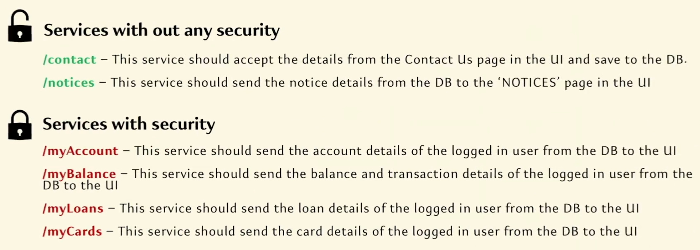
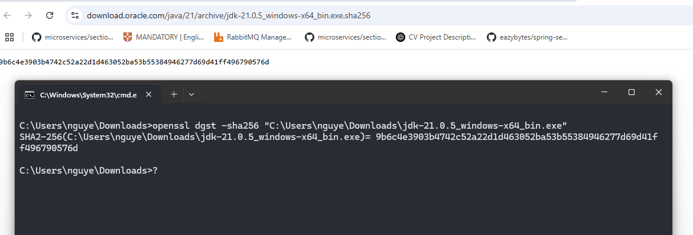

# SpringSecurity6

## Spring Security Internal flow for Default behavior


With the help of this Cookie, we don't need to log in one more time.


By Default, This bean (configuration) is used (including Security Filter Chain).
org/springframework/boot/autoconfigure/security/servlet/SpringBootWebSecurityConfiguration.java

### EasyBank API



### User Management

- Important classes & interfaces
  

- UserDetails and Authentication
  

```cmd
docker run -p 3306:3306 --name springsecurity -e MYSQL_ROOT_PASSWORD=root -e MYSQL_DATABASE=easybank -d mysql
```

Get these ddl statements from

public static final String DEFAULT_USER_SCHEMA_DDL_LOCATION = "
org/springframework/security/core/userdetails/jdbc/users.ddl";

```sql
create table users
(
    username varchar_ignorecase(50) not null primary key,
    password varchar_ignorecase(500) not null,
    enabled  boolean not null
);
create table authorities
(
    username  varchar_ignorecase(50) not null,
    authority varchar_ignorecase(50) not null,
    constraint fk_authorities_users foreign key (username) references users (username)
);
create unique index ix_auth_username on authorities (username, authority);
```

Sample data

```sql
INSERT
IGNORE INTO `users` VALUES ('user', '{noop}EasyBank@12345', '1');
INSERT
IGNORE INTO `authorities` VALUES ('user', 'read');

INSERT
IGNORE INTO `users` VALUES ('admin', '{bcrypt}$2a$12$mPHprbS37SYbqmAdzCkI7eKYlUwgqfSgzKvLZge4.XDldxqUUhlDe', '1');
INSERT
IGNORE INTO `authorities` VALUES ('admin', 'admin')
```

## Encoding, Decoding and Hashing

### Encoding

Encoding: Like send image, video, audio in Gmail.

To encode base64 using this command

```cmd
openssl base64 -in src/main/resources/encode/plain.txt -out src/main/resources/encode/encoded.txt
```

To decode base64 using this command

```cmd
openssl base64 -d -in src/main/resources/encode/encoded.txt -out src/main/resources/encode/decoded.txt
```

### Encrypt

To encrypt using this command
-aes-256-cbc: encryption algorithm
12345: secret key
pbkdf2: add salt to derive another internal key. Pb means password based, k means key, d means derive, f2 means function
-base64 means: once the encryption is going to be completed, encode the encrypted data with the help of base64 (readable
format)

```cmd
openssl enc -aes-256-cbc -pass pass:12345 -pbkdf2 -in src/main/resources/encyption/plain.txt -out src/main/resources/encyption/encrypted.txt -base64
```

To decrypt using this command

```cmd
openssl enc -aes-256-cbc -base64 -pass pass:12345 -d -pbkdf2 -in src/main/resources/encyption/encrypted.txt -out src/main/resources/encyption/decrypted.txt
```

### Hashing

To hash using this command
dgst: means digest
sha256: means hash algorithm

```cmd
echo -n "BaoND@12345" | openssl dgst -sha256
```

To hash a file using this command

```cmd
openssl dgst -sha256 <file_name>
```



#### Drawbacks of Hashing

1. Brute force attack
2. Dictionary attack
3. Rainbow attack

#### Overcome all these drawbacks

1. Salt → dictionary and rainbow attack are not possible. hashing (Salt and plaintext password) = hashed password
2. Make hashing function slows the hashing process and demands lots of CPU cost, memory cost→ brute force attack is also
   not possible

#### Overcome all these drawbacks with the help of Spring Security

Spring Security provides industry recommended PasswordEncoder that are capable of generating random salt and leverage
password hashing algorithm (PBKDF2, bcrypt, scrypt and Argon2).


Pbkdf2 putting an extra burden on top of the developers because the developers have to provide secret and function.
Strength only based upon the secret and function

BCryptPasswordEncoder we can config the strength from 4 to 31 and random values.

SCrypt is an advanced version of BCryptPasswordEncoder. When using SCryptPasswordEncoder, we can configure CPU cost,
memory cost and parallelization.
ScryptPasswordEncoder is stronger than BCryptPasswordEncoder.

Argon2 hashing algorithm is the latest hashing algorithm, which is an advanced version of SCrypt hashing algorithm. This
also allows you to configure CPU cost, memory cost and parallelization. The way Argon2 and SCrypt work, it is almost
similar, just that Argon2 is the latest version and it handles the drawbacks of a SCryptPasswordEncoder.

But the recommended PasswordEncoder is BCryptPasswordEncoder. When using SCryptPasswordEncoder or Argon2PasswordEncoder,
the configuration is going to be more tough because we have to provide CPU cost, memory cost and parallelization.
Using BCryptPasswordEncoder, it's straightforward.

## How Spring Security Handles Multiple Provider?

When multiple AuthenticationProviders are registered in ProviderManager, Spring Security iterates through them in order
until one of these happens:

1. First provider authenticates successfully → No other providers are checked.
2. First provider returns null → Spring moves to the next provider.
3. First provider throws an exception → Authentication stops immediately (second provider is NOT executed).
4. All providers return null → Authentication fails (ProviderNotFoundException).
