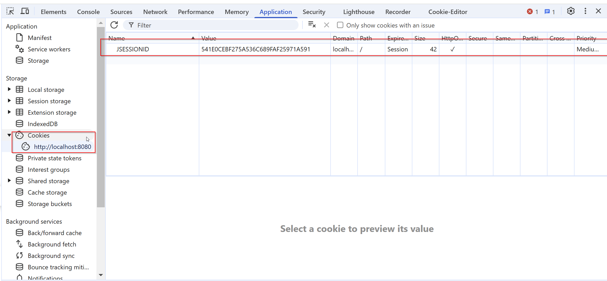
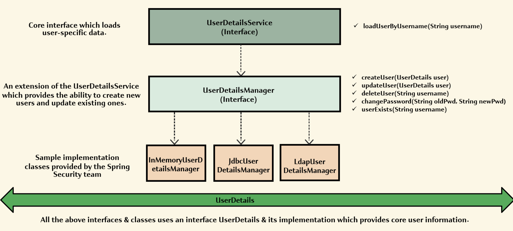
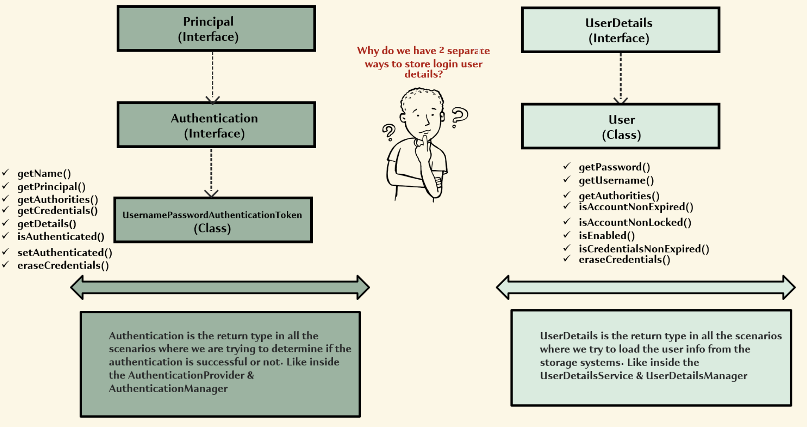

# SpringSecurity6

## Spring Security Internal flow for Default behavior


With the help of this Cookie, we don't need to log in one more time.



By Default, This bean (configuration) is used (including Security Filter Chain).
org/springframework/boot/autoconfigure/security/servlet/SpringBootWebSecurityConfiguration.java


### EasyBank API


### User Management
- Important classes & interfaces


- UserDetails and Authentication
 


```cmd
docker run -p 3306:3306 --name springsecurity -e MYSQL_ROOT_PASSWORD=root -e MYSQL_DATABASE=easybank -d mysql
```

Get these ddl statements from 

public static final String DEFAULT_USER_SCHEMA_DDL_LOCATION = "org/springframework/security/core/userdetails/jdbc/users.ddl";
```sql
create table users(username varchar_ignorecase(50) not null primary key,password varchar_ignorecase(500) not null,enabled boolean not null);
create table authorities (username varchar_ignorecase(50) not null,authority varchar_ignorecase(50) not null,constraint fk_authorities_users foreign key(username) references users(username));
create unique index ix_auth_username on authorities (username,authority);
```


Sample data
```sql
INSERT IGNORE INTO `users` VALUES ('user', '{noop}EasyBank@12345', '1');
INSERT IGNORE INTO `authorities` VALUES ('user', 'read');

INSERT IGNORE INTO `users` VALUES ('admin', '{bcrypt}$2a$12$mPHprbS37SYbqmAdzCkI7eKYlUwgqfSgzKvLZge4.XDldxqUUhlDe', '1');
INSERT IGNORE INTO `authorities` VALUES ('admin', 'admin')
```